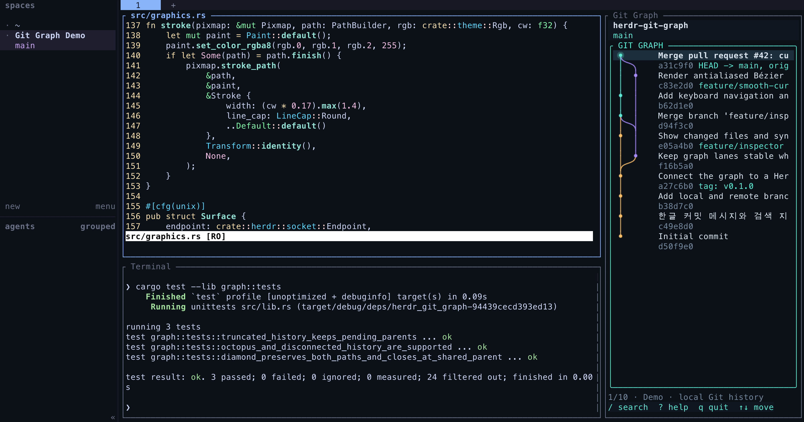

# Herdr Git Graph

**코드 옆에 Git 이력을 두고, diff가 필요할 때 전체 화면으로 살펴보세요.**

[](https://github.com/sjlee06/herdr-git-graph/actions/workflows/ci.yml)
[](LICENSE)
[](https://herdr.dev/docs/plugins/)

[English](README.md) · 한국어

Rust + Ratatui로 만든 조회 전용 Git 그래프 플러그인입니다. 작업 화면 오른쪽에 작은 그래프를 두고, 탭을 옮기지 않고 브랜치·병합 이력을 살펴보거나 커밋을 검색할 수 있습니다. 브랜치 필터와 커밋 diff는 전체 화면에서 확인하세요. 호환되는 Herdr 패널에서는 부드러운 곡선을, 일반 터미널에서는 컬러 Unicode 그래프를 표시합니다.

<p align="center">
  
</p>

*Herdr 전체 작업 화면입니다. 중앙에는 실제 앱 소스와 테스트를, 오른쪽 40열 분할에는 Git Graph 데모를 표시했습니다. 그래프는 classic 테마이며 아래 전체 보기와 같은 데모 이력을 사용합니다.*

## 주요 기능

- **그래프 사이드바:** 작업 화면 오른쪽에 기본 40열로 열고 기존 패널의 포커스를 유지. 작업하면서 이력을 검색하고 로컬 변경을 확인.
- **브랜치·병합 그래프:** 분기별 색상, 브랜치·태그 표시, detached HEAD와 linked worktree 지원.
- **커밋 상세 보기:** 메타데이터, 변경 파일 통계, 컬러 diff를 한 화면에서 확인.
- **미커밋 변경 사항:** HEAD 위에 `Uncommitted changes`를 표시하고 스테이징·미스테이징 diff, 새 파일 목록과 충돌 상태를 확인.
- **자동 갱신:** 기본 2초 간격으로 파일 변경과 로컬 커밋·브랜치 변경을 반영. 선택 항목과 스크롤 위치 유지.
- **검색과 탐색:** 메시지·작성자·ref·해시 검색, 키보드·마우스 조작.
- **부드러운 곡선:** Herdr 그래픽 API를 통한 베지어 곡선 출력과 일반 터미널용 문자 그래프.
- **터미널 테마 연동:** 현재 배경·글자색·팔레트를 조회해 반영. 곡선 배경은 투명하게 표시하며 밝은/어두운 테마를 지원합니다. 기존 외형은 `--theme classic`으로 선택할 수 있습니다. [동작과 제한](docs/USAGE.md#terminal-theme).

## 설치

**Herdr 0.9.0 이상**, **Git 2.31 이상**, `curl`이 필요합니다. **Rust나 Cargo는 설치하지 않아도 됩니다.** 설치 스크립트가 환경에 맞는 [릴리스 실행 파일](https://github.com/sjlee06/herdr-git-graph/releases)을 내려받고 `shasum` 또는 `sha256sum`으로 SHA-256 체크섬을 검증합니다.

배포 실행 파일은 **macOS 11 이상**, **glibc 2.35 이상인 Linux**(예: Ubuntu 22.04 이상)의 Apple Silicon/ARM64 및 x86_64를 지원합니다. 다른 환경에서는 [소스 빌드 안내](docs/DEVELOPMENT.md)를 참고하세요.

```bash
herdr plugin install sjlee06/herdr-git-graph
```

Git 저장소가 열려 있는 Herdr 작업 공간에서 사이드바를 엽니다. 현재 패널 오른쪽에 표시하며 작업 중인 패널의 포커스를 유지합니다.

```bash
herdr plugin action invoke herdr.git-graph.sidebar
```

사이드바는 기본 **40열**로 열립니다. 그래프 옆의 `Uncommitted changes`와 Herdr 테두리·스크롤바 공간을 고려한 폭입니다. 원래 패널이 작거나 Herdr 분할 비율 제한에 걸리면 가능한 폭으로 조절합니다. 분할선을 드래그하거나 `prefix+r`로 크기를 바꾸고, `prefix+l`로 그래프에 이동한 뒤 `q`로 닫을 수 있습니다.

최소 표시 공간인 24열 × 8행에서도 `/ search`, `? help`, `q quit` 안내가 모두 보입니다. 도움말은 화면에 맞춰 줄바꿈되며 `↑↓`·`j/k`·`PgUp/PgDn`으로 스크롤하고 `Esc`·`?`·`q`로 닫습니다. 긴 검색어를 입력해도 입력 위치가 보입니다.

### 전체 화면


*같은 데모 이력을 브랜치 목록·커밋 상세 패널과 함께 표시한 전체 화면입니다. 두 이미지는 앱의 Ratatui 화면과 곡선 렌더러에 `--theme classic`을 적용해 생성했습니다. [문자 모드 미리보기](docs/preview-text.svg).*

브랜치별 이력을 살펴보거나 커밋 diff를 확인할 때는 새 탭으로 전체 그래프를 엽니다.

```bash
herdr plugin action invoke herdr.git-graph.open
```

특정 저장소를 직접 지정할 수도 있습니다.

```bash
herdr plugin pane open \
  --plugin herdr.git-graph \
  --entrypoint graph \
  --cwd /path/to/repository \
  --focus
```

### 단축키 연결

`~/.config/herdr/config.toml`에 사용하지 않는 키를 등록합니다. **`prefix+g`는 Herdr 기본 `goto`, `prefix+shift+g`는 워크트리 생성과 충돌합니다.** 아래 예시는 기본 설정에서 비어 있는 `u` 조합을 사용합니다. 이미 사용자 단축키로 쓰고 있다면 다른 키를 선택하세요.

```toml
[[keys.command]]
key = "prefix+u"
type = "plugin_action"
command = "herdr.git-graph.open"
description = "Open Git Graph"

[[keys.command]]
key = "prefix+shift+u"
type = "plugin_action"
command = "herdr.git-graph.sidebar"
description = "Open Git Graph Sidebar"
```

`herdr config check`로 충돌을 확인하고 `herdr server reload-config`를 실행하세요. 설정한 prefix 다음 `u`는 전체 그래프, `Shift+u`는 사이드바를 엽니다. 기존 그래프용 `prefix+g` 항목은 위 설정으로 교체하세요.

## 사용법

전체 화면에서 브랜치를 선택하고 **Enter**를 누르면 해당 브랜치의 이력만 표시합니다. **All branches**를 선택하거나 **a**를 누르면 전체 이력으로 돌아갑니다. 커밋을 선택하면 아래 상세 패널에서 변경 내용을 확인할 수 있습니다.

| 키 | 동작 |
| --- | --- |
| `Tab` / `Shift-Tab` | 전체 화면에서 패널 전환 |
| `↑` `↓` / `j` `k` | 항목 이동 또는 diff 스크롤 |
| `Enter` | 검색 적용; 전체 화면에서는 브랜치 필터 적용 / 상세 패널 이동 |
| `/`, `n` / `N` | 검색, 다음 / 이전 검색 결과 |
| `a` | 전체 브랜치 보기 |
| `r` | 로컬 이력 새로고침 |
| `d` | 전체 화면에서 상세 패널 표시 / 숨기기 |
| `?` | 스크롤 가능한 도움말 열기 / 닫기 |
| `q` / `Ctrl-C` | 종료; 도움말이 열려 있으면 `q`는 도움말부터 닫기 |

마우스 클릭으로 항목을 선택하고 포인터 아래 패널을 휠로 스크롤할 수 있습니다. 전체 단축키, 렌더러 설정, 문제 해결은 [상세 사용 안내](docs/USAGE.md)를 참고하세요.

로컬 Git 데이터를 조회합니다. 파일 저장, 스테이징, 커밋과 브랜치 변경은 기본 2초 간격으로 자동 반영하며 `r`로 즉시 새로고침할 수도 있습니다. 원격의 새 커밋은 기존 Git 작업 흐름에서 fetch한 뒤 자동 반영됩니다. fetch·checkout·commit·merge·rebase·push는 실행하지 않습니다. 검색은 불러온 이력을 대상으로 하며, **기본 2,000개 커밋**을 `--limit`으로 조정할 수 있습니다.

`Uncommitted changes`는 변경이 있을 때 전체 이력 또는 현재 체크아웃한 브랜치의 맨 위에 표시합니다. 첫 커밋 전 저장소와 detached HEAD도 지원합니다. 새 파일은 목록에 표시하며 내용 diff는 스테이징된 파일과 기존 추적 파일에 제공됩니다. `.gitignore`로 제외된 미추적 파일은 표시하지 않습니다.

자동 갱신은 백그라운드에서 Git 상태를 확인하는 방식입니다. HEAD와 ref가 같으면 커밋 이력을 재사용하고, 화면이 같으면 다시 그리지 않습니다. 조회가 느리면 간격을 조회 소요 시간의 4배 이상으로 늘립니다. 큰 저장소에서는 `--refresh-interval 5`로 간격을 조정하거나 `--no-auto-refresh`로 끄고 `r`을 사용하세요. 조회 시 인덱스를 기록하거나 선택적 잠금을 잡지 않습니다.

## Herdr 없이 실행

```bash
git clone https://github.com/sjlee06/herdr-git-graph.git
cd herdr-git-graph
sh scripts/install.sh

./bin/herdr-git-graph --demo --sidebar
./bin/herdr-git-graph --demo
./bin/herdr-git-graph --repo /path/to/repository
./bin/herdr-git-graph --repo /path/to/repository --sidebar
```

일반 터미널에서는 문자 그래프를 사용합니다. 픽셀 곡선은 호환되는 Herdr 패널과 바깥 터미널이 필요합니다. [렌더러 안내](docs/USAGE.md#renderers)에서 설정과 문자 모드 전환 조건을 확인할 수 있습니다.

## 개발 및 기여

로컬 플러그인 연결, 빌드, 테스트, 코드 구조는 [개발 안내](docs/DEVELOPMENT.md)에 정리했습니다. [검증 기록](docs/VALIDATION.md)에는 자동화 테스트와 실제 터미널 화면 검증의 범위를 구분해 두었습니다.

버그 제보와 기여를 환영합니다. 이슈를 등록할 때 OS, Herdr 버전, 터미널 종류, 재현 방법을 함께 적어주세요.

## 라이선스

[MIT](LICENSE). [Herdr](https://herdr.dev/)용 독립 커뮤니티 플러그인입니다.
