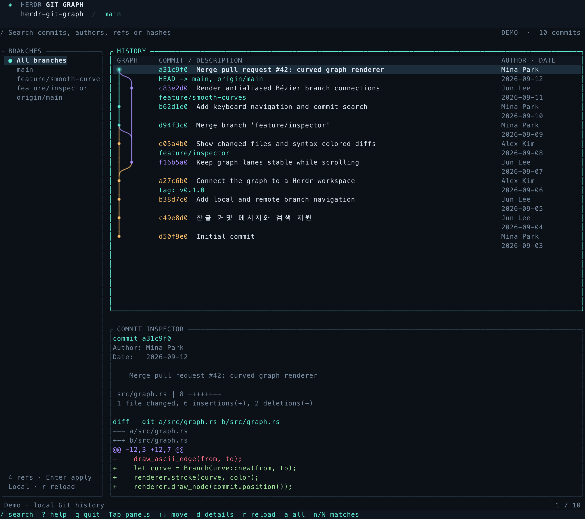

# Herdr Git Graph

**Explore Git branches, merges, and commit diffs without leaving Herdr.**

[](https://github.com/sjlee06/herdr-git-graph/actions/workflows/ci.yml)
[](LICENSE)
[](https://herdr.dev/docs/plugins/)

English · [한국어](README.ko.md)

A read-only Git graph viewer built with Rust and Ratatui. Browse local and remote-tracking branches, follow merge history, search commits, and inspect diffs. Compatible Herdr panes display smooth curves; other terminals use a colored Unicode graph.



*Demo snapshot generated from the application's Ratatui layout and curve renderer. [Text-mode preview](docs/preview-text.svg).*

## Features

- **Branch and merge graph** — colored lanes, branch and tag labels, and support for detached HEAD and linked worktrees.
- **Commit inspector** — commit metadata, changed-file statistics, and colored diffs in one view.
- **Uncommitted changes** — a working tree node above HEAD, with staged/unstaged diffs, untracked file names, and conflict counts.
- **Live updates** — background checks every 2 seconds reflect local file, commit, and branch changes while preserving selection and scroll position.
- **Search and navigation** — find a message, author, ref, or hash; navigate with the keyboard or mouse.
- **Smooth curves with a text fallback** — antialiased Bézier connections through Herdr's graphics API, plus a Unicode renderer for ordinary terminals.

## Install

Requires **Herdr 0.9.0+**, **Git 2.31+**, and `curl`. **Rust and Cargo are not required.** The installer downloads a matching [release binary](https://github.com/sjlee06/herdr-git-graph/releases) and verifies its SHA-256 checksum using `shasum` or `sha256sum`.

Prebuilt releases support **macOS 11+** and **Linux with glibc 2.35+** (for example, Ubuntu 22.04+), on Apple Silicon/ARM64 and x86_64. For other systems, see [source builds](docs/DEVELOPMENT.md).

```bash
herdr plugin install sjlee06/herdr-git-graph
```

From a Herdr workspace containing a Git repository, open the graph in a new tab:

```bash
herdr plugin action invoke herdr.git-graph.open
```

To open a specific repository:

```bash
herdr plugin pane open \
  --plugin herdr.git-graph \
  --entrypoint graph \
  --cwd /path/to/repository \
  --focus
```

### Add a keybinding

Add an available key to `~/.config/herdr/config.toml`:

```toml
[[keys.command]]
key = "prefix+u"
type = "plugin_action"
command = "herdr.git-graph.open"
description = "Open Git Graph"

[[keys.command]]
key = "prefix+shift+u"
type = "plugin_action"
command = "herdr.git-graph.sidebar"
description = "Open Git Graph Sidebar"
```

`prefix+g` conflicts with Herdr's default `goto` action, and `prefix+shift+g` creates a worktree. Replace an existing graph binding on `prefix+g` with the example above. The `u` bindings are unused by Herdr defaults; choose others if your custom config already uses them. Run `herdr config check`, then `herdr server reload-config`. Press your prefix followed by `u` for the full view or `Shift+u` for the sidebar.

### Graph sidebar

```bash
herdr plugin action invoke herdr.git-graph.sidebar
```

Opens a graph-only pane to the right of the current pane while keeping focus on your work. The sidebar shows the graph, commit subjects, hashes, and ref labels, with no branch list or diff inspector. It fits panes as small as 24 columns × 8 rows and supports search, keyboard navigation, and mouse scrolling.

Drag the split divider or use Herdr's resize mode (`prefix+r`) to adjust the width. Use `prefix+l` to focus the graph and `q` inside it to close. For an existing terminal split, run `./bin/herdr-git-graph --sidebar --repo /path/to/repository`.

## Use

Select a branch and press **Enter** to show its history. Choose **All branches**, or press **a**, to return to the complete view. Select a commit to inspect its details below.

| Key | Action |
| --- | --- |
| `Tab` / `Shift-Tab` | Switch panels |
| `↑` `↓` / `j` `k` | Navigate items or scroll the diff |
| `Enter` | Apply a branch filter / focus the inspector |
| `/`, then `n` / `N` | Search, then jump between matches |
| `a` | Show all branches |
| `r` | Reload local Git history |
| `d` | Toggle the inspector |
| `?` | Show all shortcuts |
| `q` / `Ctrl-C` | Quit |

Mouse clicks select items; the wheel scrolls the panel under the pointer. See the [usage guide](docs/USAGE.md) for all shortcuts, rendering options, and troubleshooting.

The viewer reads local Git data and automatically reflects saved files, staging, commits, and branch changes. Press `r` for an immediate reload. To see new remote commits, fetch in your normal Git workflow; the viewer picks up the local update. It does not run fetch, checkout, commit, merge, rebase, or push. Search covers the loaded history: **2,000 commits by default**, configurable with `--limit`.

`Uncommitted changes` appears above HEAD in the all-refs view and the checked-out branch view, including before the first commit. The inspector separates staged and unstaged patches; untracked files are listed by name. Ignored untracked files are excluded. Background checks reuse history while refs and HEAD are unchanged, skip unchanged redraws, and back off for slow repositories. Use `--refresh-interval 5` to check less often or `--no-auto-refresh` for manual refresh only. See the [usage guide](docs/USAGE.md#uncommitted-changes-and-live-updates) for details.

## Run without Herdr

```bash
git clone https://github.com/sjlee06/herdr-git-graph.git
cd herdr-git-graph
sh scripts/install.sh

./bin/herdr-git-graph --demo
./bin/herdr-git-graph --repo /path/to/repository
```

Standalone mode uses the Unicode graph. Pixel curves require a compatible Herdr pane and outer terminal. See [renderer selection](docs/USAGE.md#renderers) for details.

## Development

The [development guide](docs/DEVELOPMENT.md) covers local plugin linking, builds, tests, and the source layout. [Validation notes](docs/VALIDATION.md) distinguish automated checks from live terminal graphics testing.

Bug reports and contributions are welcome. Please include your OS, Herdr version, terminal, and the steps to reproduce the issue.

## License

[MIT](LICENSE). An independent community plugin for [Herdr](https://herdr.dev/).
